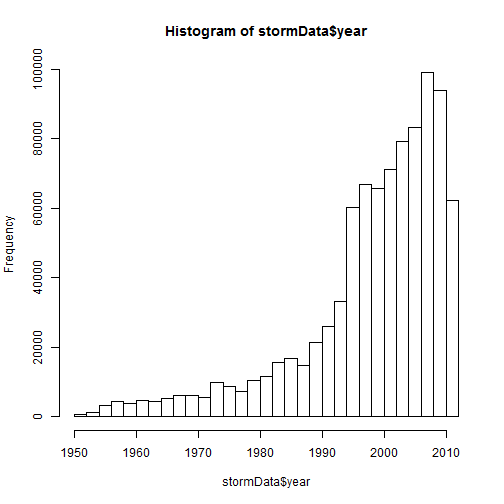
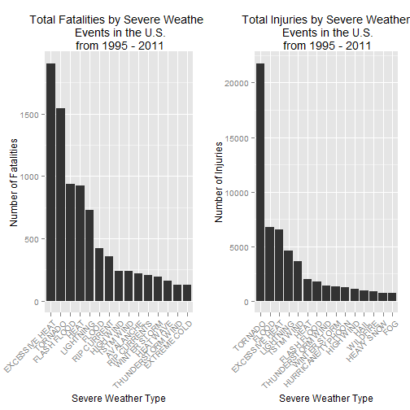
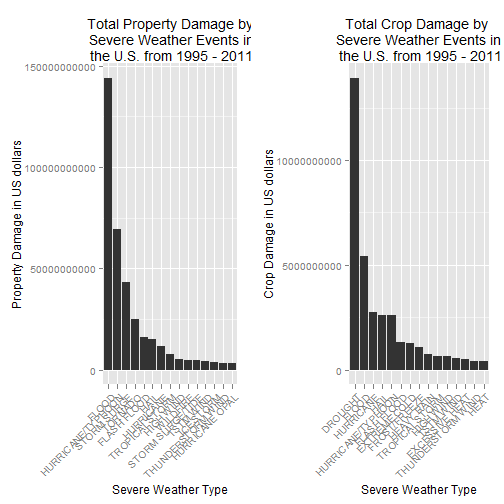

# Programming Assignment 2:
========================================================

## Synopsis : 

In this research we are trying to assess the impact of diverse weather events on public healthy and the economy based on a database that was collected from the U.S National Oceanic and Atmospheric Administrtion (NOAA) from 1950-2011. We will use estimates of the fatalietes and injuries and property/crop damage to decide which types of events are most harmful to the economy and population. The results show that excessive heat and tornados are the most harmful events with respect to population healht while the floods, droughts and hurricanes/typhoons have the greatest economic impact.


## 1) Loading and preprocessing the data


```
## Warning: package 'plyr' was built under R version 3.1.1
```

```
## Warning: package 'R.utils' was built under R version 3.1.3
```

```
## Loading required package: R.oo
```

```
## Warning: package 'R.oo' was built under R version 3.1.3
```

```
## Loading required package: R.methodsS3
```

```
## Warning: package 'R.methodsS3' was built under R version 3.1.3
```

```
## R.methodsS3 v1.7.0 (2015-02-19) successfully loaded. See ?R.methodsS3 for help.
## R.oo v1.19.0 (2015-02-27) successfully loaded. See ?R.oo for help.
## 
## Attaching package: 'R.oo'
## 
## The following objects are masked from 'package:methods':
## 
##     getClasses, getMethods
## 
## The following objects are masked from 'package:base':
## 
##     attach, detach, gc, load, save
## 
## R.utils v2.0.0 (2015-02-28) successfully loaded. See ?R.utils for help.
## 
## Attaching package: 'R.utils'
## 
## The following object is masked from 'package:utils':
## 
##     timestamp
## 
## The following objects are masked from 'package:base':
## 
##     cat, commandArgs, getOption, inherits, isOpen, parse, warnings
```

```
## Warning: package 'ggplot2' was built under R version 3.1.1
```

```
## Loading required package: gridExtra
```

```
## Warning: package 'gridExtra' was built under R version 3.1.1
```

```
## Loading required package: grid
```

```
## [1] 902297     37
```

```
##   STATE__          BGN_DATE BGN_TIME TIME_ZONE COUNTY COUNTYNAME STATE
## 1       1 4/18/1950 0:00:00     0130       CST     97     MOBILE    AL
## 2       1 4/18/1950 0:00:00     0145       CST      3    BALDWIN    AL
##    EVTYPE BGN_RANGE BGN_AZI BGN_LOCATI END_DATE END_TIME COUNTY_END
## 1 TORNADO         0                                               0
## 2 TORNADO         0                                               0
##   COUNTYENDN END_RANGE END_AZI END_LOCATI LENGTH WIDTH F MAG FATALITIES
## 1         NA         0                        14   100 3   0          0
## 2         NA         0                         2   150 2   0          0
##   INJURIES PROPDMG PROPDMGEXP CROPDMG CROPDMGEXP WFO STATEOFFIC ZONENAMES
## 1       15    25.0          K       0                                    
## 2        0     2.5          K       0                                    
##   LATITUDE LONGITUDE LATITUDE_E LONGITUDE_ REMARKS REFNUM
## 1     3040      8812       3051       8806              1
## 2     3042      8755          0          0              2
```


There are 902297 rows and 37 columns in total. The events in the database start in the year 1950 and end in November 2011. In the earlier years of the database there are generally fewer events recorded, most likely due to a lack of good records. More recent years should be considered more complete. We will now make a histogram :


```r
if (dim(stormData)[2] == 37) {
    stormData$year <- as.numeric(format(as.Date(stormData$BGN_DATE, format = "%m/%d/%Y %H:%M:%S"), "%Y"))
}
hist(stormData$year, breaks = 30)
```

 

Based on the above histogram, we see that the number of events tracked starts to significantly increase around 1995. So, we use the subset of the data from 1990 to 2011 to get most out of good records.


```r
storm <- stormData[stormData$year >= 1995, ]
dim(storm)
```

```
## [1] 681500     38
```


## 2) Impact on Public Health

In this section, we check the number of fatalities and injuries that are caused by the severe weather events. We would like to get the first 15 most severe types of weather events.


```r
sortHelper <- function(fieldName, top = 15, dataset = stormData) {
    index <- which(colnames(dataset) == fieldName)
    field <- aggregate(dataset[, index], by = list(dataset$EVTYPE), FUN = "sum")
    names(field) <- c("EVTYPE", fieldName)
    field <- arrange(field, field[, 2], decreasing = T)
    field <- head(field, n = top)
    field <- within(field, EVTYPE <- factor(x = EVTYPE, levels = field$EVTYPE))
    return(field)
}

fatalities <- sortHelper("FATALITIES", dataset = storm)
injuries <- sortHelper("INJURIES", dataset = storm)
```

## 3) Impact on Economy

We will convert the property damage and crop damage data into comparable numerical forms according to the meaning of units described in the code book (Storm Events). Both PROPDMGEXP and CROPDMGEXP columns record a multiplier for each observation where we have Hundred (H), Thousand (K), Million (M) and Billion (B).


```r
convertHelper <- function(dataset = storm, fieldName, newFieldName) {
    totalLen <- dim(dataset)[2]
    index <- which(colnames(dataset) == fieldName)
    dataset[, index] <- as.character(dataset[, index])
    logic <- !is.na(toupper(dataset[, index]))
    dataset[logic & toupper(dataset[, index]) == "B", index] <- "9"
    dataset[logic & toupper(dataset[, index]) == "M", index] <- "6"
    dataset[logic & toupper(dataset[, index]) == "K", index] <- "3"
    dataset[logic & toupper(dataset[, index]) == "H", index] <- "2"
    dataset[logic & toupper(dataset[, index]) == "", index] <- "0"
    dataset[, index] <- as.numeric(dataset[, index])
    dataset[is.na(dataset[, index]), index] <- 0
    dataset <- cbind(dataset, dataset[, index - 1] * 10^dataset[, index])
    names(dataset)[totalLen + 1] <- newFieldName
    return(dataset)
}

storm <- convertHelper(storm, "PROPDMGEXP", "propertyDamage")
```

```
## Warning in convertHelper(storm, "PROPDMGEXP", "propertyDamage"): NAs
## introduced by coercion
```

```r
storm <- convertHelper(storm, "CROPDMGEXP", "cropDamage")
```

```
## Warning in convertHelper(storm, "CROPDMGEXP", "cropDamage"): NAs
## introduced by coercion
```

```r
names(storm)
```

```
##  [1] "STATE__"        "BGN_DATE"       "BGN_TIME"       "TIME_ZONE"     
##  [5] "COUNTY"         "COUNTYNAME"     "STATE"          "EVTYPE"        
##  [9] "BGN_RANGE"      "BGN_AZI"        "BGN_LOCATI"     "END_DATE"      
## [13] "END_TIME"       "COUNTY_END"     "COUNTYENDN"     "END_RANGE"     
## [17] "END_AZI"        "END_LOCATI"     "LENGTH"         "WIDTH"         
## [21] "F"              "MAG"            "FATALITIES"     "INJURIES"      
## [25] "PROPDMG"        "PROPDMGEXP"     "CROPDMG"        "CROPDMGEXP"    
## [29] "WFO"            "STATEOFFIC"     "ZONENAMES"      "LATITUDE"      
## [33] "LONGITUDE"      "LATITUDE_E"     "LONGITUDE_"     "REMARKS"       
## [37] "REFNUM"         "year"           "propertyDamage" "cropDamage"
```

```r
options(scipen=999)
property <- sortHelper("propertyDamage", dataset = storm)
crop <- sortHelper("cropDamage", dataset = storm)
```


## 4) Results

As for the impact on public health, we have got two sorted lists of severe weather events below by the number of people badly affected.


```r
fatalities
```

```
##               EVTYPE FATALITIES
## 1     EXCESSIVE HEAT       1903
## 2            TORNADO       1545
## 3        FLASH FLOOD        934
## 4               HEAT        924
## 5          LIGHTNING        729
## 6              FLOOD        423
## 7        RIP CURRENT        360
## 8          HIGH WIND        241
## 9          TSTM WIND        241
## 10         AVALANCHE        223
## 11      RIP CURRENTS        204
## 12      WINTER STORM        195
## 13         HEAT WAVE        161
## 14 THUNDERSTORM WIND        131
## 15      EXTREME COLD        126
```

```r
injuries
```

```
##               EVTYPE INJURIES
## 1            TORNADO    21765
## 2              FLOOD     6769
## 3     EXCESSIVE HEAT     6525
## 4          LIGHTNING     4631
## 5          TSTM WIND     3630
## 6               HEAT     2030
## 7        FLASH FLOOD     1734
## 8  THUNDERSTORM WIND     1426
## 9       WINTER STORM     1298
## 10 HURRICANE/TYPHOON     1275
## 11         HIGH WIND     1093
## 12              HAIL      916
## 13          WILDFIRE      911
## 14        HEAVY SNOW      751
## 15               FOG      718
```

And the following is a pair of graphs of total fatalities and total injuries affected by these severe weather events.


```r
fatalitiesPlot <- qplot(EVTYPE, data = fatalities, weight = FATALITIES, geom = "bar", binwidth = 1) + 
    scale_y_continuous("Number of Fatalities") + 
    theme(axis.text.x = element_text(angle = 45, 
    hjust = 1)) + xlab("Severe Weather Type") + 
    ggtitle("Total Fatalities by Severe Weather\n Events in the U.S.\n from 1995 - 2011")
injuriesPlot <- qplot(EVTYPE, data = injuries, weight = INJURIES, geom = "bar", binwidth = 1) + 
    scale_y_continuous("Number of Injuries") + 
    theme(axis.text.x = element_text(angle = 45, 
    hjust = 1)) + xlab("Severe Weather Type") + 
    ggtitle("Total Injuries by Severe Weather\n Events in the U.S.\n from 1995 - 2011")
grid.arrange(fatalitiesPlot, injuriesPlot, ncol = 2)
```

 

Based on the above histograms, we find that excessive heat and tornado cause most fatalities; tornato causes most injuries in the United States from 1995 to 2011.

As for the impact on economy, we have got two sorted lists below by the amount of money cost by damages.


```r
property
```

```
##               EVTYPE propertyDamage
## 1              FLOOD   144022037057
## 2  HURRICANE/TYPHOON    69305840000
## 3        STORM SURGE    43193536000
## 4            TORNADO    24935939545
## 5        FLASH FLOOD    16047794571
## 6               HAIL    15048722103
## 7          HURRICANE    11812819010
## 8     TROPICAL STORM     7653335550
## 9          HIGH WIND     5259785375
## 10          WILDFIRE     4759064000
## 11  STORM SURGE/TIDE     4641188000
## 12         TSTM WIND     4482361440
## 13         ICE STORM     3643555810
## 14 THUNDERSTORM WIND     3399282992
## 15    HURRICANE OPAL     3172846000
```

```r
crop
```

```
##               EVTYPE  cropDamage
## 1            DROUGHT 13922066000
## 2              FLOOD  5422810400
## 3          HURRICANE  2741410000
## 4               HAIL  2614127070
## 5  HURRICANE/TYPHOON  2607872800
## 6        FLASH FLOOD  1343915000
## 7       EXTREME COLD  1292473000
## 8       FROST/FREEZE  1094086000
## 9         HEAVY RAIN   728399800
## 10    TROPICAL STORM   677836000
## 11         HIGH WIND   633561300
## 12         TSTM WIND   553947350
## 13    EXCESSIVE HEAT   492402000
## 14 THUNDERSTORM WIND   414354000
## 15              HEAT   401411500
```

And the following is a pair of graphs of total property damage and total crop damage affected by these severe weather events.


```r
propertyPlot <- qplot(EVTYPE, data = property, weight = propertyDamage, geom = "bar", binwidth = 1) + 
    theme(axis.text.x = element_text(angle = 45, hjust = 1)) + scale_y_continuous("Property Damage in US dollars")+ 
    xlab("Severe Weather Type") + ggtitle("Total Property Damage by\n Severe Weather Events in\n the U.S. from 1995 - 2011")

cropPlot<- qplot(EVTYPE, data = crop, weight = cropDamage, geom = "bar", binwidth = 1) + 
    theme(axis.text.x = element_text(angle = 45, hjust = 1)) + scale_y_continuous("Crop Damage in US dollars") + 
    xlab("Severe Weather Type") + ggtitle("Total Crop Damage by \nSevere Weather Events in\n the U.S. from 1995 - 2011")
grid.arrange(propertyPlot, cropPlot, ncol = 2)
```

 


Based on the above histograms, we find that flood and hurricane/typhoon cause most property damage; drought and flood causes most crop damage in the United States from 1995 to 2011.

## 5) Conclusion

From these data, we found that excessive heat and tornado are most harmful with respect to population health, while flood, drought, and hurricane/typhoon have the greatest economic consequences.
